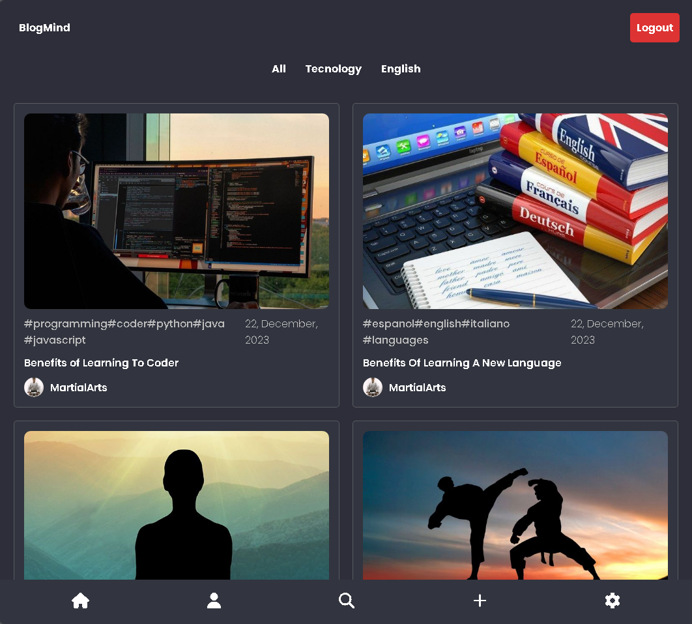
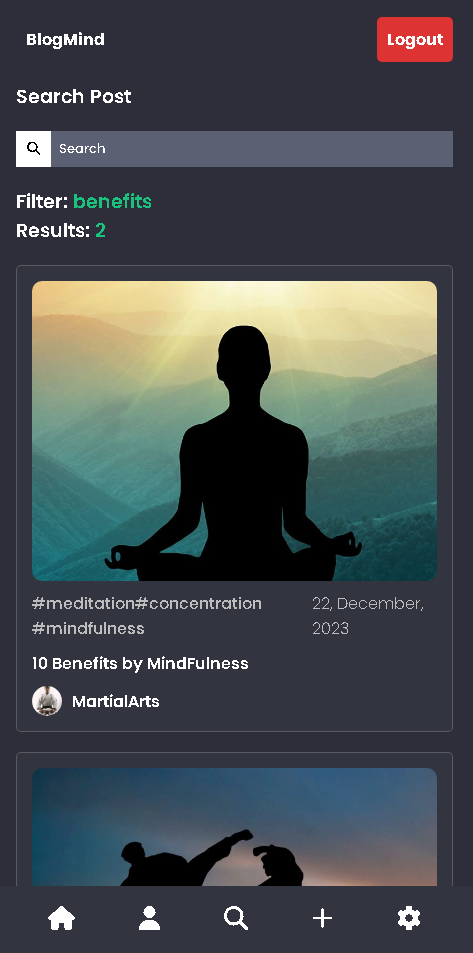
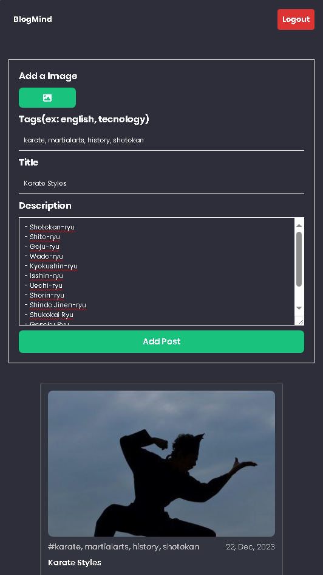
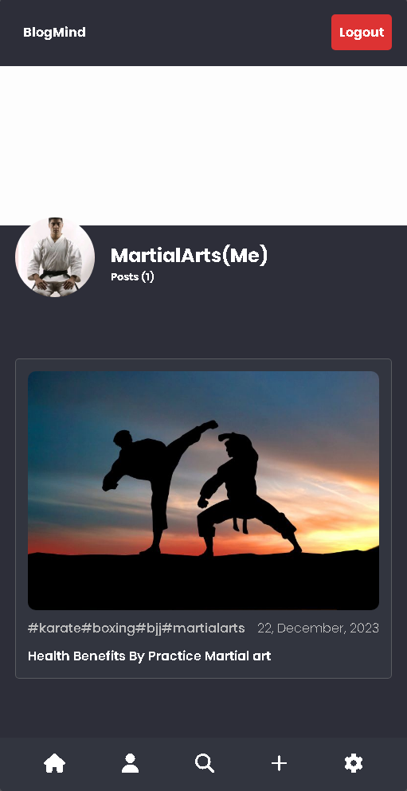
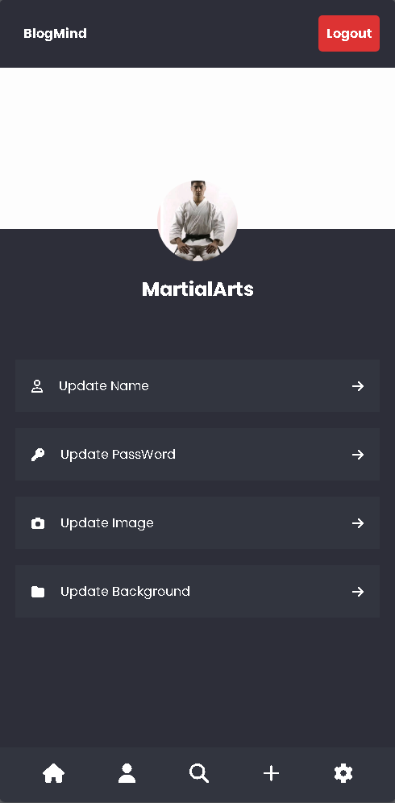
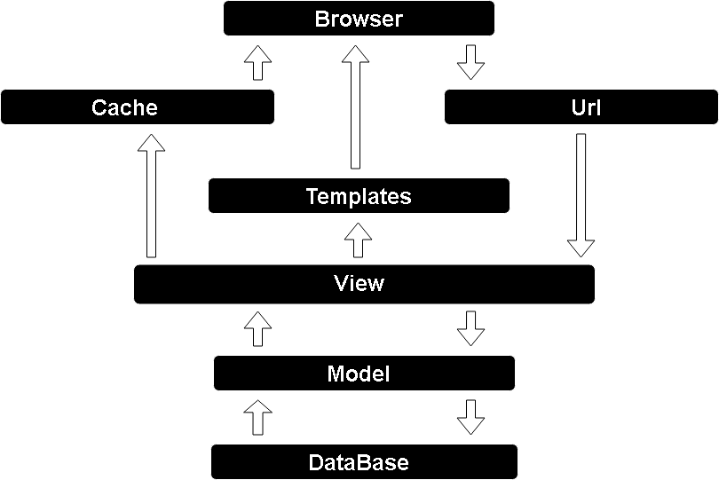

# BlogMind


The BlogMind aims to provide knowledge in various areas, making it accessible to everyone. Additionally, we offer interactive pages for easy comprehension to further enrich your experience!

We are an open community, welcoming curious minds in the pursuit and sharing of knowledge. 😊

With an interface focused on languages and technologies, we invite you to contribute if you have a unique perspective or experience in both areas. :)

## Links

- [Project]()

## Pages

### Home Layout



### Seach Post Layout



### Detail Post Layout

https://github.com/V1KILL/PROJETO-BLOGMIND/assets/105511964/8b91df16-b477-4cb5-a47d-067ac2ad14d4

### Post + Preview Layout



### Perfil Layout



### Account Layout



## Conceptual Model

.png)

## Architecture



## Features

### Authentication

- **Account Login:** Allows users to authenticate in the application.
- **Account Register:** Enables new users to create an account.

### User

- **Change Profile Picture:** Allows users to update their profile picture, customizing the appearance of their account.

- **Change Profile Background:** Offers the option to change the profile background, allowing users to further personalize their presence on the platform.

- **Change Your Name:** Enables users to update their name.

- **Change Your Password:** Provides a secure way for users to update their passwords, ensuring the security of their accounts.


### Post

- **Post with Preview:** Allows users to preview how a post will look before publishing it, ensuring proper content presentation.

- **Filter by Post Title:** Enables efficient searching for specific posts by filtering content based on post titles.

- **Filter Posts by Tags:** Facilitates navigation through specific posts by allowing users to filter content based on relevant tags.

- **Comment on Post:** Allows users to add comments to posts, promoting interaction and discussion within the community.

- **Edit Post:** Provides the ability to edit existing posts, allowing users to update information or correct errors.

- **Remove Post:** Allows users to delete their own posts, providing control over published content.

- **View Post Details:** Gives users the ability to view specific details of a post.

- **Share Post:** Allows users to copy the post link to share with others.

## Technologies Used

### Back-End
- Python
- Django
- JavaScript

### Front-End
- HTML
- CSS
- JavaScript

### Deploy
- Back-End: Glitch
- Front-End: Firebase
- Database: MySQL

## Run Project

#### Prerequisite
- Python 3.11

```bash

# Clone Repository
git clone https://github.com/V1KILL/PROJETO-BLOGMIND.git

# Activate Virtual Environment
.\venv\Scripts\activate

# Activate Virtual Environment (Linux)
source venv/bin/activate

# Install Dependencies
pip install -r requirements.txt

# Apply Migrations
python manage.py migrate

# Start the Server
python manage.py runserver

```
